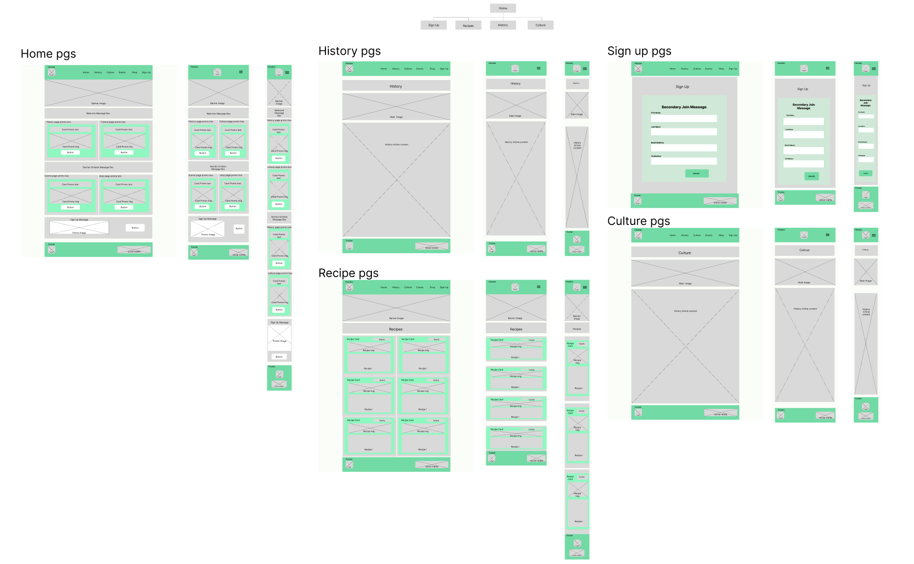

# Happy Cups
## About
### Background
I decided to bring this idea to life in the form of a static website when I realised I didn't understand much about tea and what I did seem to know, seemed contradictory. Given the long history of tea and how disengaging existing media on the topic, a website seemed the best option to remedy this challenge.

### Purpose
The Happy Cups website is a page for casual tea drinkers to learn more about tea to better understand what they are buying and encourage exploration of new teas based beverages.
This Happy cups pages offer recipes, information and external links to helpful resources to achieve this.
Users of the website will find all they need to know on the website to provide a solid elementary understanding of the tea landscape to encourage exploration including but not limited to: History, Information on tea blends and recipes.

---
## Technologies
- HTML Formatter: used to format HTML pages and ensure reliability and maintainability of code and features 
- Figama: used to create the design of the website and constituent pages 
- CSS: used to style HTML pages and create responsive and intuitive UX 
- HTML: used to create the components that made up the website
- VS Code: IDE used to develop the site
- Git: used for version control of the website and creating a local repo.
- GitHub: used as a remote repo to store the commits of the project in a place that can be shared.
- GitHub Pages: part of github used to host the website file and create a live project
- Convertio: used to convert the file type of images to WEBP
- MS Word: used to spell check content and remove typos
- Material Theme Builder: used to develop colour pallet for website and ensure Accessibility would persist
- Monokai++: an addon in vs code used to make interpreting code easier and development more efficient
- Live Server : an addon in vs code that enabled a local server on the 127.0.0.1 port to host the website and view the pages and components during development
- Canva: was used to create the website logo in svg and png formats for use on the page.
- FontAwesome: used for icon elements across the website
- Google Fonts: used to import the Roboto font for use in website theme
---
## Design

### Wireframes
- The wireframe for the full website was used to develop the method to plan how to structure site content.
In completing the wireframe for the site I was able to begin development in code more effectively as I has an initial target to work towards.

- The design of the site evolved as the project went on. this was due to increased understanding of technical capability with CSS, and HTML as the primary tools for this website and experimenting with layouts with Dev Tools while keeping UX in mind.

- In future projects I will use more advance functionality of design tools, to develop a more polished design. This will minimise the amount of changes as I did find that my design evolved significantly. In doing this I will be able to complete project more efficiently.

- Below are the wire frames for the site:
  
  
  

### Themes
- The focus of this project being tea the selected pallet was chosen to emote calm, zen and nature.
with these aims in mind the colour pallet was chosen.
- The colour scheme of the website was created with this in mind using the material theme build tool as a baseline and modifying the pallet to better capture the essence of the theme.
  
- The font was also selected to stay uniform with the theme as such only "Roboto" a sans-serif based font was used in the project.

### Images
- Images used in the site are royalty free or have been shared under the open source licence full references and credits below.

### Layout
- The layout of the website uses card components to assist with creating a streamline UX  
- The theme of the website components was created with reference to the  [Material Design 3](https://m3.material.io) guidelines.
- layout can be seen to persist across the entire site as shown in the pages section below
- In-addition to cards a combination of flex-box and grids were used to maintain the structure of the site
---
## Features

### Navigation  
- Navbar 

  
  
  - Header introduces the theme of the website 
  - The navbar is fixed to allow for navigation to any page regardless of current location. 
  - The navbar is multi layer that enables users to navigate to different pages of the same topic
  - The navbar has  active effects to help the user understand where they are in the site via persistent highlighting
  - The navbar has hover effects to help the user navigate to the desired page via highlighting the selection 

### Pages
All pages are fully responsive on all devices down to a minimum screen width of 320px
- Home page: is a hub that directs users to other pages with engaging layout and images.

  

- History page: introduces users to key events in the western history of tea. This page presents historical periods and events in liner order leveraging a timeline.
  - Stylised list with hover effects and pseudo classes.
  - more content section to guide uses to other related pages and/or sources 

  

- Variants &amp; Blends page: provides users with information to understand about tea blends and the factors that go into making a blend, in addition to recommendations of brands to try.
  - flex grid and card layout 
  - more content section to guide uses to other related pages and/or sources 

  

- Recipes page: provides users with different recipes to try at home to broaden tea experiences
  - flex grid and card layout 
  - more content section to guide uses to other related pages and/or sources 

  

- Culture: informs users about popular teas and tea culture in countries around the globe
  - Modified list for card containerised style
  - Extra content delivered via iframe
  - more content section to guide uses to other related pages and/or sources 

  

- Sign-up page: hosts the sign up form that the user is encouraged to fill out to join the mailing list
  - Contact form with required input

---
## Testing &amp; Validation

- The website was tested in Chrome, Mozilla and Opera browser. All features are supported and page maintained functionality.
- The website was tested on both desktop and mobile devices. The page is responsive to a screen width of 320px 
- Dev tools used to emulate all devices from desktop to small mobile range to secure responsiveness.
- Changes can be seen in the evolution of commits. Commits show refining of scope of project to current version.
- Accessibility of the page was assessed using the in browser Lighthouse report. all values were in good range for accessibility and performance. Where performance was lower it was due to the use of iframes and other content. In order to minimise file sizes webp file formats were used for most images.

  
  
  
  
  
  

- [HTML Validator from w3 schools](https://validator.w3.org) was used to validate formatting of HTML pages. SUCCESS on all pages
- [Jigsaw CSS validator](https://jigsaw.w3.org/css-validator/) was used to validate CSS stylesheet. SUCCESS no errors found in file

---
## Bugs

- To enable easy user navigation the header is fixed to the screen. The navbar is made of a flex box to enable responsiveness. However, when centred the navbar seemed to shrink at a different rate from the rest of the page resulting in a gap and inability to use website on smaller devices.
This issue was that the nav bar was a greater size than the viewport and when fixed the navbar was removed form the context of the page as such did not grow and shrink at the same rate causing a gap. This was resolved by uses of overflow-x property on the html and body.

- When scrolling some elements would go over the header instead of underneath. To resolve this the z-index of the header was set very high as it should always be the top most element.
- When scrolling or loading a page large would be significant. This was due to the abundance and file size of the image resources used. This was resolved by removing non essential sections and changing file format to WEBP 
- Uncentered section children components on smaller screens despite flex column with justified and centre aligned properties. This was resolved by creating a new flex column class without the flex property meaning the content would no longer arrange itself as it does in a responsive manner.

- During validation of HTML card component with rotate on click effect produced an error. For the on click to work the div making up the card was placed inside a label for a checkbox input so a checked psudo class could be used to transform the card - no alternative to do this effect without using is so on click swapped to hover which may impede user experience but resolved validation error.
 

- When initially deployed to github pages the file structure was different with the html pages bar index in a html folder under assets. Despite correct referencing and a working site when spun up on the VS Code private live server. This was fixed by placing the other html document in the same level as the index.html file and assets folder.
---
## Deployment
- The project was developed in VS Code to gain experience developing code in a commonly found IDE.
- I created all the basic folders and files I needed for the webpage including html files for all web pages, and css stylesheet.
- In VS Code after creating a new terminal the repository was inialised with the git init command
- using git add . followed by git commit -m "initial commit" the files were staged and committed to the local repo
- In github I created a new repo for the project and linked the remote repo the local VS code environment which enabled a CI/CD workflow for the project.

- In the project specific github repo navigated to the 'Settings -> Pages' section 
- Selected the source to be the main branch of the project.
- Project deployed on github pages to [here](https://sabgibson.github.io/hot-cups/)
---
## Credits
### Persons
- Reuben Ferrante - for constructive feedback and insight on resources to develop the project
- Pexel Contributors Kim Cruz et al - for royalty free images used in the site
- Unsplash Contributors Amit Ranjan et al - for royalty free images used in the site
- CI community - for support throughout the project 
### Media
- Home page:
  - [Teacup tea](https://www.cleanpng.com/png-green-tea-tieguanyin-tea-culture-u9752u8336-bowl-o-539369/) 
  - [Matcha Set](https://www.cleanpng.com/png-japanese-tea-ceremony-matcha-milkshake-japanese-cu-439696/)
  - [Kettle](https://www.cleanpng.com/png-tea-egg-coffee-teapot-menu-kettle-268936/)
- Variants &amp; Blend

  - [EIC](https://www.theeastindiacompany.com/wp-content/uploads/2013/06/Logo.png)
  - [MF Logo](https://commons.wikimedia.org/wiki/File:Logo_seul.jpg)
  - [TWG Logo](https://cdn.shopify.com/s/files/1/0276/9744/6989/files/0001_7e584cdc-62da-497c-b87e-46ff2b7bc044_3508x.jpg?v=1608801500)
  - [Whittard Logo](https://eu-assets.simpleview-europe.com/portsmouth2020/imageresizer/?image=%2Fdmsimgs%2FWhittard_1213980555.jpg&action=ProductDetailImage)
  - [Green Tea Image](https://unsplash.com/photos/OHYSVSId8mA)
  - [Oolong Loose Image ](https://unsplash.com/photos/gT_rAfFvCyw)
  - [White Tea Image](https://www.pexels.com/photo/person-holding-sliced-vegetables-on-basket-39347/)
- History
  - [Bubble Tea](https://www.pexels.com/photo/clear-plastic-cup-with-brown-liquid-and-ice-4071422/)
  - [India Tea Farm](https://unsplash.com/photos/mhJODzwzCtg)
  - [Han China](https://www.pexels.com/photo/a-woman-in-robe-sitting-at-a-table-with-tea-pots-and-tea-cups-8952605/)
  - [Sakura Tree](https://www.pexels.com/photo/pink-cherry-blossom-tree-5765782/)
  - [Tea Ceremony](https://www.pexels.com/photo/person-in-red-and-white-floral-long-sleeve-shirt-holding-white-ceramic-mug-8748542/)
  - [England Card Image](https://www.pexels.com/photo/a-performer-drinking-from-a-tea-cup-6842334/)
  - [Monk With Beads](https://www.pexels.com/photo/man-in-red-robe-standing-near-green-trees-5385901/)
  - [Cha Character](https://en.m.wikipedia.org/wiki/File:Tea_(Chinese_characters).svg)

- Recipes
  - [Mint Tea](https://www.pexels.com/photo/fresh-green-tea-463445/)
  - [Lemon Tea](https://www.pexels.com/photo/green-tea-in-oriental-cup-on-table-5946715/)
  - [Chai Tea](https://www.pexels.com/photo/cup-of-masala-chai-on-table-5946623/)
  - [Classic Mug](https://www.pexels.com/photo/orange-ceramic-mug-with-coffee-5596479/)
  - [Brown Milk Tea](https://www.pexels.com/photo/a-person-holding-clear-glass-cup-of-coffee-7038283/)
  - [Camomille Tea](https://www.pexels.com/photo/cup-of-aromatic-camomile-tea-on-ornamental-tablecloth-10213086/)
  - [Lemon Grass Tea](https://www.pexels.com/photo/a-person-making-tea-8329270/)
  - [Red Tea](https://www.pexels.com/photo/herbal-black-tea-pouring-into-glass-5946807/)
  - [Honey Tea](https://unsplash.com/photos/1S4JCCWq2mg)
  - [Cinnamon Tea](https://www.pexels.com/photo/lemon-tea-served-on-teacup-1717767/)
  - [Apple Tea](https://www.pexels.com/photo/red-apples-and-cherries-on-wooden-table-6116508/)
  - [Bubble Tea In Hand](https://www.pexels.com/photo/a-person-holding-a-milk-tea-6412830/)

- Culture
  - [Touareg Main Image](https://unsplash.com/photos/Lj6OgKfNkdI)
  - [Karkade Main Image](https://unsplash.com/photos/DyndLuY1rII)
  - [Rooibos Main Image](https://unsplash.com/photos/K0jaKN1M1Ck)
  - [Yerba Mate Main Image](https://www.pexels.com/photo/stainless-steel-pitcher-on-table-8279918/)
  - [Arnold Palmer Main Image](https://www.pexels.com/photo/mason-jar-with-beverage-1141626/)
  - [Afternoon Tea Main Image](https://www.pexels.com/photo/tea-beside-cupcakes-1796450/)
  - [Masala Chai Main Image](https://unsplash.com/photos/zI27XpN1GdA)

### Research Materials
These were used to find out more about tea and increase competence so that it would be possible to complete the website:
- [Source 1](http://www.coffeeteawarehouse.com/tea-history.html)
- [Source 2](https://www.teatulia.com/tea-varieties/what-is-white-tea.htm)
- [Source 3](https://www.teatulia.com/tea-101/tea-varieties.html)
- [Source 4](https://www.whittard.co.uk/)
- [Source 5](https://www.mariagefreres.com/UK/welcome.html)
- [Source 6](https://twgtea.com)

### Technology 
Technologies used during the project can be found here:
- [Convertio](https://convertio.co/)
- [Canva](https://www.canva.com/)
- [Figma](https://www.figma.com/)
- [Github](https://github.com/)
- [MDN Web Docs](https://developer.mozilla.org)
- [FontAwesome](https://fontawesome.com)
- [Google Fonts](https://fontawesome.com)

---
## Licences &amp; Copyright
All resources used in this project are under free use policies.
The use of the resources in this project do not infract on the fair uses or terms of use of these resources
